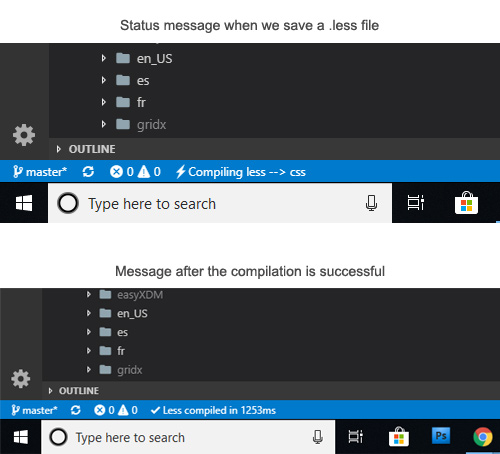
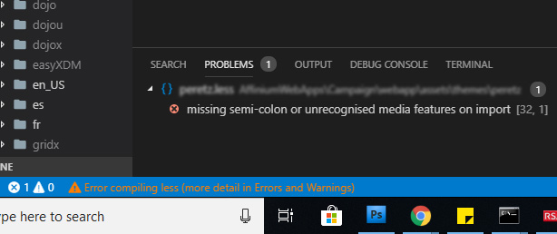

Writing code is fun, interesting and fulfilling. However, debugging is an equally important skill. Solving an issue sometimes may give you a taste of hell especially when you are not aware where to look for the root cause. At first, a defect may look simple, but figuring out what to debug and where to hunt demands for attention. Today was a fine morning, after sipping my coffee and afresh, I was sure I would destroy the task at hand point blank. Fate was not on my side and I hit a roadblock. I spent almost 2hrs trying to figure what could possibly go wrong, most of the time starring at the screen clueless. I needed a different perspective.

<!-- truncate -->

### Background

We have a product in which we use `.less` to write our styles. Being a dojo/dijit integration, it already has many .less files in its theme. We then made our custom theme and created our own `.less` files which are then eventually converted to a single `.css` file.

My task at hand was to delete all the code that was written specifically for IE6 browser. Dojo adds a browser specific class to body which can then be used to target styles for that browser. I had to delete code. Easy. I love the delete button on my keyboard.

### The Setup

Visual Studio Code is my primary code editor and I used [Easy LESS extension](https://marketplace.visualstudio.com/items?itemName=mrcrowl.easy-less) to Auto-compile LESS to CSS on save. It worked really well. 
Every time I saved a change in my `.less` file, it would show an indication in the status bar about the time required to convert the `.less` to `.css`

### What Happened today

I started deleting most obvious lines of code which I was pretty confident. I hit the ctrl+s to save my changes and then I opened my main`.less` file to compile all the changes throughout project. `main.less` basically has all the imports from various other files. For. eg import of button.less and `color.less` and so on. So after every change in a particular file, I had to compile `main.less` to get the final `.css` output. 

Today, when I saved the changes, I was expecting to see the compilation successful message. To my surprise, the editor message stuck to "Compiling LESS to CSS". I waited a longer but in vain.

### Debug mistake - Looking at the wrong place

Since the changes were not reflecting, I was not sure where to look for.
I did not see any compilation error messages on the screen nor on the debug console or terminal or anything on the problems tab. Strange.

I thought there was some issue with compiler.

- I restarted my editor. It did not work
- I then re-installed the Easy LESS extension, still it did not work
- I remembered that we are using a special setting for compilation, i.e we are using relativeURL in our .less code, so I changed the settings. I saved the main.less file again and still it was stuck at the message.
- I then reverted the changes and it was of no use.

After following several trial and error attempts, I decided to discard the extension and look for another extension in the VS Code Marketplace. There, I found Easy Compile. I tried installing it, but this time the compilation would not work. I did not see any status message. Perhaps it needed some settings.

### Loosing patience

I then deleted the Easy Compile extension and restored back to Easy LESS extension. I had used this extension several times and I desperately wanted to get it working. I lost patience.

I had to take break. I was already an hour and half doing stupid activities.

### The problem

I then looked with a fresh mind. At first I had concluded that the problem was with the compiler. I had to rethink my approach. Since the `main.less` has imports of various different .less files, I deleted the entire code in it and saved my changes.

To my surprise, the compilation message was successful. It returned an empty `main.css` file. The error was in the code. But where?

It hit me like a lightning bolt. I had made changes to the code. But why was I not getting any error message? I then realized, the file which I was compiling was different compared to the file which had error.

Also, the file in which I deleted that said variable compiled successfully. However the file which was using that variable had not been triggered for compilation. Hence no error logged. And that is why the main.less compilation was stuck.

### The Solution

I did a global search for the variable in question, deleted all the instances of it and compiled each file. I then compiled main.less file and got the final `.css` file. A lesson learned.

Below is how the error message appears on failed compilation.

### Conclusion

I learned very important lesson

- Do not debug a issue based on wild guess and assumptions
- Try to replicate the issue by making dramatic changes in the code. Observe if your changes lead to a better conclusion. For eg. In my main.less file, I deleted all the imports which should create at least a blank `.css` file. Since it created a blank `.css` file, I was at least assured that the compiler worked fine.
- Test the positive scenarios to get an understanding of the code. Observe the pattern of how the code worked before making any changes.
- Make obvious changes to the code to see if you are in the correct file. For example, introduce an alert or a debugger statement. This will ensure that you are making changes in the correct file.
- Do not debug an issue on guess work. For example, by making code changes in a file that has similar name as the UI module you are trying to fix debug. This will only waste your debug efforts. Identify the correct source code file beforehand.
- Re-installing the software and re-starting the computer should be the last option. Literally.
- Be patient. Software does not work on hope and luck. Understand that software is written based on logic and algorithm and hence every output that you see on the screen has a base.

#### P.S
I had faced this same issue earlier around a year back. I did remember this but I could not recollect how I got my way through that time. I am documenting this experience for I know I would need it somewhere in the future. Also, I hope this helps someone on the interwebs.
