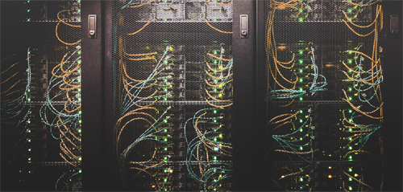

First, a little background. I had an important feature delivery in the coming week but due to personal work, had to take two days off on a short notice. This meant, I had to complete my current development tasks. "No Problemo !", I thought. My inspiration for working overnight comes form the movie, "The Social Network". I have mentioned about how amazing the soundtrack of the movie is, umpteen times, here on this blog. This essay is my retrospection per se on working overnight.

Work commitments of an important feature delivery and family never go in hand. You will spend more time working compared to the time spent with family or honing your hobbies, the universal accepted law for the software professional by the software professional, always holds true. 

<!-- truncate -->

Due to personal work, I had to take two days off on a very short notice. This meant that I had to complete my current development tasks. The task at hand was doable, however there was a time crunch. The only option I had was to stretch and work overnight. I set a plan of action and put a checklist.
- Drink black coffee (my favourite)
- Listen to the soundtrack of the movie "The social network". (I am listening to it right now while I type this blog post)
- Code, debug, repeat.
- Log every half hour of my experience

With everything in order, I had my mind set to achieve the goal. I put a time check for 10.00 PM, when everyone in the family would be asleep allowing me to work on my tasks. 

This post is my retrospection of working overnight. Let the fun begin.

## What went well?
Everything was planned ahead of time. I had accounted for various tasks and had foreseen blockers. I had a clear picture of the development work that was expected from me. Since my code would be used by the backend team for further execution, I had to ensure that all the test cases were accounted for and taken care of well in advance.

### No external distractions
I could differentiate clearly the effects of working in an office environment versus working alone. There were no distractions, no small talks and it was peaceful. I could hear the tick of the clock every second, and I loved it. There were zero meetings and no chat messages. As opposing I am of group meetings, I understand that they are important. But when you have a deadline, meetings can be skipped. Working in silence, my concentration skyrocketed. 

### Extensive code comments
I've grown to honour the fact that extensive commenting is a necessity in every line of code that we write. As a developer, I had to re-visit my own code down the line and with a weak memory lane, it was always as good as reading someone else's piece of code. I would struggle. But with extensive commenting, It always becomes easier to deep dive in the codebase. 

With clear and distraction free mindset, I spent quality time writing detailed comments. Sometimes, I would comment the flow of what I want to achieve followed by the line of code and sometimes it was vice versa. The point is, I could feel that my thoughts were crystal clear.

### Ownership
I was independently working on this task and had the complete ownership of it. This meant, I had to ensure that every corner of the testing be completed on time before the delivery. 

It could have been the excitement of working overnight or it could be the sense of ownership, but I felt the responsibility of ensuring that I had completed everything on my tasks list.

### End to end testing
I was doing a module that was user facing i.e developing the User interface. There were some API's that were still under development. I did not want to be blocked so I figured a way around. I tried mocking the response signature which then helped me continue in my development. This may sound obvious but sometimes it so happens that some team members want to get all the work ready on which they are dependent instead of mocking their way around. 

How did working overnight help me here?
I googled my way around to see if there was any API service that I could use and sure there was, I found mocky. It is simple to use and I could also set delays on the response, which helped me test my loading API. If I had waited for the API, instead of writing this post, I would still be working on my task.

### Coffee and Bourbon
I have an affinity towards black coffee. I prepared a cup at my leisure and to add to the icing, I had an entire packet of bourbon (my favourite biscuits) at my disposal. The combination was amazing and it kept me intrigued.

## What didn't go well
Nothing can be as perfect as it sounds. Working overnight also had its downsides. Even though it was a planned activity, coding may not always work as expected. Sometimes, a simple semicolon could give you a headache and if you loose patience, solving a tiny bug becomes horrendous. 

### Distractions
Even though concentration skyrocketed, my coffee breaks ranged between 5 - 15 minutes every 30 minutes. Sometimes I would think about a problem only to realize that I was in some other world of thoughts altogether. It was funny. 

### Server restarts and cache deletions
Despite of preparation, technical issues always arise. Our applications need a constant server restarts and most of the time when there are JavaScript changes, we need to always clear browser cache. Such tiny tasks take up mundane efforts which eventually lead to frustrations.

### Sleep deprivation
At around 2.00 AM, my eyes hurt. I wasn't feeling sleepy, but I wished I was in bed. My train of thoughts, basically it stopped. I could feel the tiredness. I was just half way through my work and it was a sad realization. I then realized that working late nights is not heroic as it sounds. 

### Hacker News FTW
To keep working, I visited Hacker News. Somehow I believed that since I was in the middle of the night, the amazing folks at the other side of the globe would be at work and would post some amazing links which would be upvoted and worth a read. In the end, the goal was to keep myself awake. 

## Conclusion
The experience was overall, amazing and at the same time very tiring.

What did I learn?
- Always finish your tasks on time. Stick to the deadlines.
- In your task breakup, account for a buffer time. Due to uncertain circumstances, it may seem impossible to complete a task on a give timeline. You cannot calculate an exact time, but at least have yourself breathing time.
- I would definitely not prefer working overnight. The body along with the mind needs a considerable amount of rest. Some of the most successful entrepreneurs may have turned stones into gold working late hours, but we cannot always step in their shoes. 
- A single night of experience may not be enough to reach to a conclusion. Working late hours was quite an experience. I would not recommend it.

What next?
- I have read and watched numerous videos about waking up at 4.00 AM and getting the maximum work done. I want to be able to try doing that some day. I do have my alarm set to 3.30 AM everyday and there is no shame in hiding the truth, I never was able to get up that early. But some day, I wish to overcome the sleep and set a target. Until I experience it first hand, I wouldn't be able to tell the difference. 