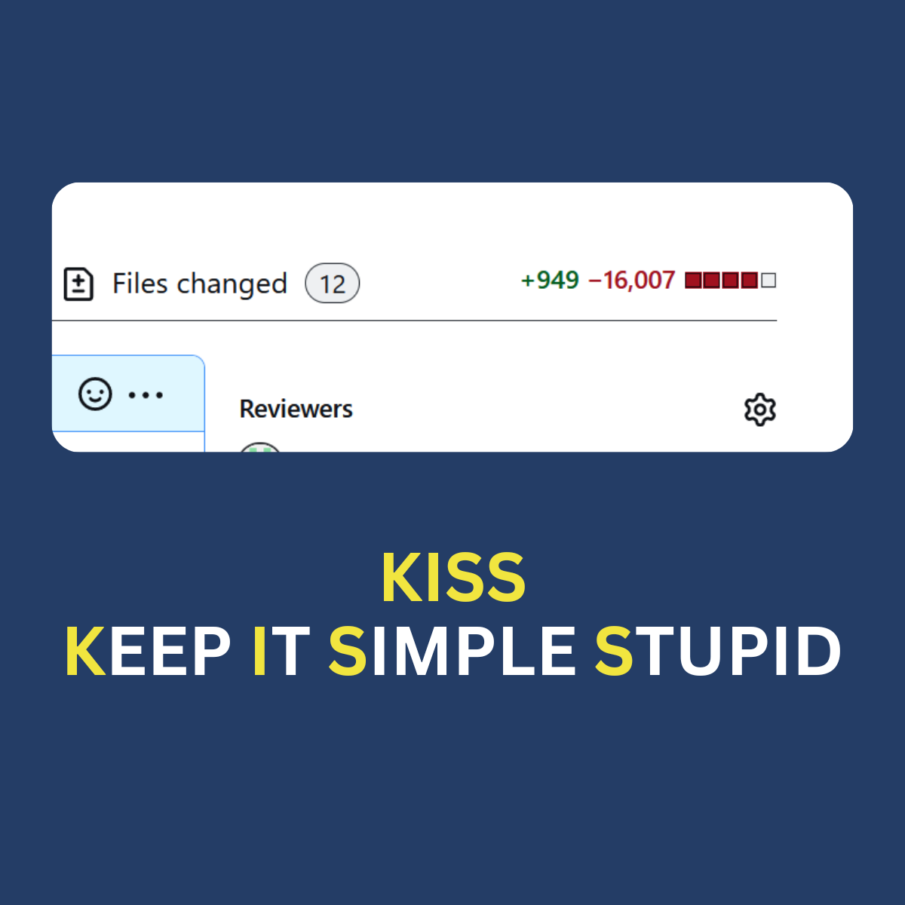

8 Years ago…

AngularJS was very popular library and talk of the town. 

The Software product had a requirement of providing a search solution with display of tabular data / pagination etc. with some UI animation.

It was decided by the tech lead and the management to go with AngularJS and there could be various reasons for it, possibly:

- AngularJS was popular framework
- Going forward all the new features in this software product had to be developed using AngularJS
- It is always exciting to work on a new technology irrespective of figuring out if it actually is needed.

This feature was released and praised, but over the years, there have been no instances of this library being used for any other features, reasons:

- Continued usage of the legacy framework, it being the obvious choice
- The rising popularity of Angular2 over AngularJS causing lack of time and interest.
- Lack of resources / technical skills in AngularJS

So, this huge product had AngularJS as a low hanging fruit, used only for one single feature.

However, security fixes to AngularJS library were patched whenever available. 

### Transition from AngularJS to Vanilla JavaScript

Fast forward to today, and our feature remains, but the landscape has shifted.  AngularJS is officially deprecated and so we had to reevaluate our choice.

- AngularJS library is deprecated.
- Security concerns from customers
- In this entire product, AngularJS is just used for this one feature.

We chose to use Vanilla JavaScript for various reasons, though the specifics are not relevant here.

When I began working on this feature, it became clear that Vanilla JavaScript could effortlessly provide the same functionality.

### Over-Engineering and Unnecessary Complexity in the Original Code

After careful evaluation of the code, it appeared that this feature was over-engineered.

- I discovered unused or infrequently used library files, bootstrap files, and a templating engine library.
- I believe these libraries were added with the assumption that they would be useful for developing new features in the future. However, this turned out not to be the case.
- Naturally, no one wanted to work with this code again, so all the core library files were left untouched.
- There were clear violations of the DRY (Don't Repeat Yourself) and KISS (Keep It Simple, Stupid) design principles, indicating areas for improvement.

### Enter the era of simplification.

Opting for vanilla JavaScript, we embarked on a journey to streamline our codebase and embrace the principles of DRY (Don't Repeat Yourself), KISS (Keep It Simple, Stupid), and YAGNI (You Ain't Gonna Need It).

The entire exercise of removing AngularJs involved the following steps:

- Reviewing and understanding the entire feature
- Reading the AngularJS code and identifying areas for improvement
- Rewriting the entire feature using vanilla JavaScript
- Ensuring the transformation does not affect the user, as only the underlying technology is being changed, not the user experience.

### The Transformation: From Excessive to Efficient Coding

What began as an experiment turned into a revelation. With over 16K lines of unnecessary clutter stripped away, and under 1K lines of focused, purposeful addition, we emerged with a leaner, more efficient feature.

The journey wasn't without its challenges, but it was immensely rewarding. We honed our skills, boosted our confidence, and left behind a codebase that is not just functional, but elegant and maintainable.

- Increased my confidence in working independently on a feature.
- Enhanced my ability to read any framework code and convert it to vanilla JavaScript.
- Deepened my understanding of vanilla JavaScript.
- Refactored the code, making it more readable and maintainable.

As we continue to evolve, let's remember the value of simplicity, the power of pragmatism, and the importance of continuous improvement.